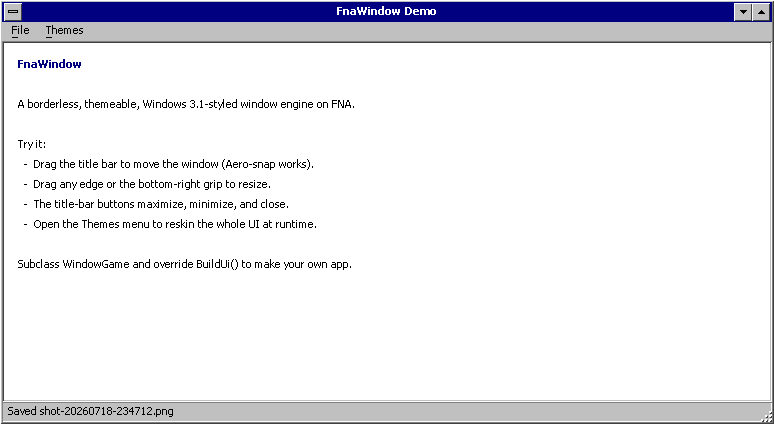

# FnaWindow

Build desktop apps with fully custom chrome on FNA. The OS title bar and border are removed, but the window still drags, resizes from any edge, maximizes, and snaps like a normal one.

It comes with a Windows 3.1 style theme (title bar, menus, bevels) as the default look. That look is just a palette plus a renderer, so you can draw the window however you like. What sits underneath is an ordinary resizable OS window with no system frame, which is enough to build a text editor, a file explorer, a chat client, dev tooling, or a small utility on top of. You write one subclass to get a working app.



## Why

Building a custom-chrome desktop window normally means fighting the OS. This engine handles that part for you:

- **Borderless with native behavior.** The OS frame is stripped (`WS_POPUP`), and drag, edge-resize, snap, and maximize still work because the window answers `WM_NCHITTEST` (the title bar acts as the caption). There is no moving-the-window-from-the-game-loop workaround.
- **Retained-mode widget toolkit.** A small `Widget` tree with a from-scratch Win 3.1 renderer (a two-function bevel system), bitmap fonts, menus, scrollbars, modal dialogs, popups, and an Open / Save As file dialog.
- **Text editing included.** `TextArea` is a complete editing widget: caret and selection, both scrollbars, undo/redo, the system clipboard, word wrap, and the standard key and mouse model. It knows nothing about languages, and it leaves hooks so a code editor can add coloring, squiggles and completion popups by subclassing rather than by reimplementing any of it.
- **Runtime theming.** Swap the whole palette while the app runs. Windows 3.1, Midnight, and Slate ship with it, and adding one is a single record literal.
- **Self-contained.** FNA and its native libraries are vendored under `lib/`, so you can clone and build with no extra setup.

The borderless path is Windows-only. On macOS and Linux the window falls back to the normal OS frame, and the rest of the toolkit works the same.

## Quick start

```sh
git clone <your-repo-url> fna-custom-window
cd fna-custom-window
dotnet run --project Demo
```

You'll get the demo window above: drag it, resize the edges, and try the **Themes** menu.

## Repository layout

```
FnaWindow.csproj     the engine, a class library (this is what you reference)
src/                 engine source: Gui/ Window/ Theme/ Editor/
Content/  lib/       vendored fonts, FNA, and its native libs
Demo/                a runnable example app that references the library
templates/           copy-paste starter for a new build-on (git-submodule wiring)
```

`FnaWindow.csproj` is a library. The demo is a separate exe (`Demo/Demo.csproj`) that references it the same way your own app would. The engine's fonts and native libraries are marked as Content, so they copy into any project that references it. A consumer gets a working window with its assets in place and nothing to copy by hand.

## Use it in your own app (git submodule)

Add the engine as a git submodule and reference the library project. Base fixes then reach your app with a `git submodule update`, and each app stays pinned to the exact engine commit it was built against.

```sh
# in your new app's repo
git submodule add <your-repo-url> engine
```

```xml
<!-- YourApp.csproj -->
<ItemGroup>
  <ProjectReference Include="engine\FnaWindow.csproj" />
</ItemGroup>
```

That single reference pulls in the engine, FNA, the native libraries, and the fonts. See **[templates/starter-app/](templates/starter-app/)** for a short starter you can copy, and **[docs/EXTENDING.md](docs/EXTENDING.md#consuming-the-engine-as-a-git-submodule)** for the full workflow (updating, pinning, and the non-submodule option).

## Build your own app

Subclass `WindowGame`, override `BuildUi`, and fill the frame:

```csharp
using System.Collections.Generic;
using FnaWindow;

public sealed class MyApp : WindowGame
{
    public MyApp() : base("My App", 900, 600) { }

    protected override void BuildUi(WindowFrame frame, BitmapFont uiFont)
    {
        // Status bar
        frame.SetStatus(new StatusBar { Message = "Hello" });

        // Your content (any Widget)
        frame.SetContent(new MyContent());

        // A menu
        var file = new List<MenuItemDef>
        {
            MenuItemDef.Item("&Quit", null, Exit),
        };
        frame.SetMenu(new MenuBar(new List<TopMenu> { new("&File", file) })
        {
            MeasureTitleWidth = uiFont.MeasureWidth,
            MeasureItemWidth  = uiFont.MeasureWidth,
        });
    }
}

// Program.cs
using var game = new MyApp();
game.Run();
```

The base class handles the borderless window, native drag and resize, the render loop, input, fonts, and the title-bar buttons.

## What's in the box

| Piece | What it is |
|---|---|
| `WindowGame` | The base FNA `Game`: borderless window, `WM_NCHITTEST` drag/resize, capped and re-entrancy-safe render loop, input, fonts. |
| `WindowFrame` | The window chrome: raised border, title bar, optional menu and status bar, content area, size grip, modal-dialog host. |
| `WindowChrome` | Win32/SDL interop: strip the frame, answer hit-tests, move/resize helpers. |
| `Win31Renderer` | Fills, bevels (`Raised/SunkenThin/Thick`), panels, text, dither, mnemonics. |
| `Widget` / `RootDesktop` / `PopupLayer` | Retained-mode tree, focus, top-most popups. |
| `TitleBar` `MenuBar` `Toolbar` `ScrollBar` `StatusBar` | The stock widgets. |
| `InputDialog` / `RetroFileDialog` | Modal prompt, confirm and message boxes; a Win 3.1 Open / Save As dialog that browses directories off the render thread. |
| `TextArea` / `TextBuffer` | Multi-line text editing: caret, selection, undo/redo, clipboard, word wrap, key and mouse model, with seams for a richer editor to subclass. |
| `Clipboard` / `Tabs` | System clipboard text with an in-process fallback; tab-to-space expansion at tab stops. |
| `Theme` / `ThemeManager` / `Palette` | Mutable palette plus runtime theme switching. |
| `MainThread` | Post background-thread results back to the render thread. |

## Docs

See **[docs/EXTENDING.md](docs/EXTENDING.md)** for the full guide: custom widgets, custom themes, menus, dialogs, the renderer primitives, and how the borderless window works.

## Fonts

Four bitmap-font atlases live in `Content/fonts/`: a proportional MS Sans Serif style UI font in regular and bold, a larger bold cut for chrome, and a Fixedsys style monospace font for text areas. Each is a PNG plus a JSON glyph map. Swap in your own by matching that format.

## License

**MIT.** See [LICENSE](LICENSE). You can build closed-source, commercial apps on it.

Vendored third-party components keep their own permissive licenses. FNA (`lib/FNA`) is the Microsoft Public License (Ms-PL); the native libraries in `lib/fnalibs` (SDL3, FAudio, FNA3D, Theorafile) are zlib or similar. All of them allow commercial, closed-source distribution as long as you preserve their notices when you ship.
